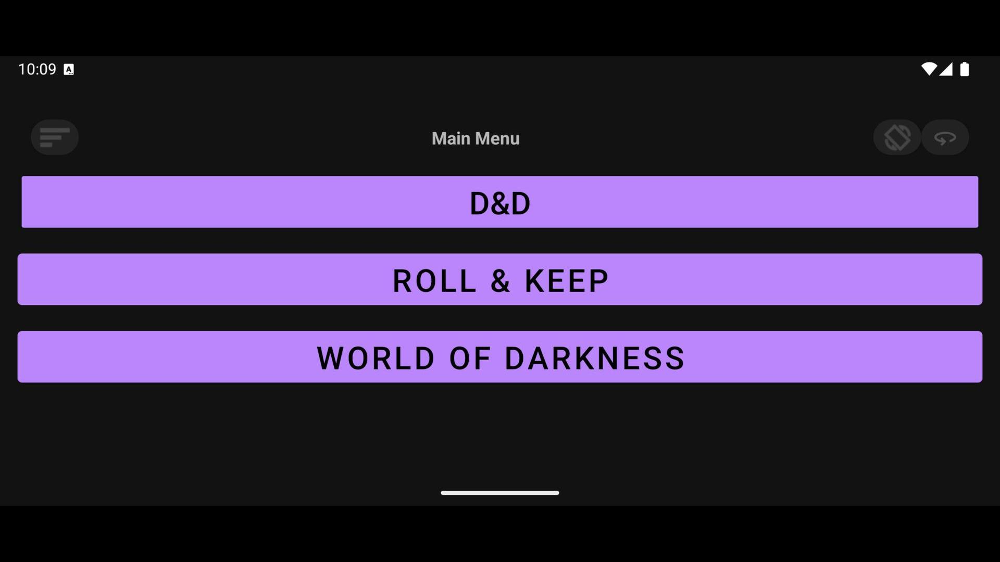
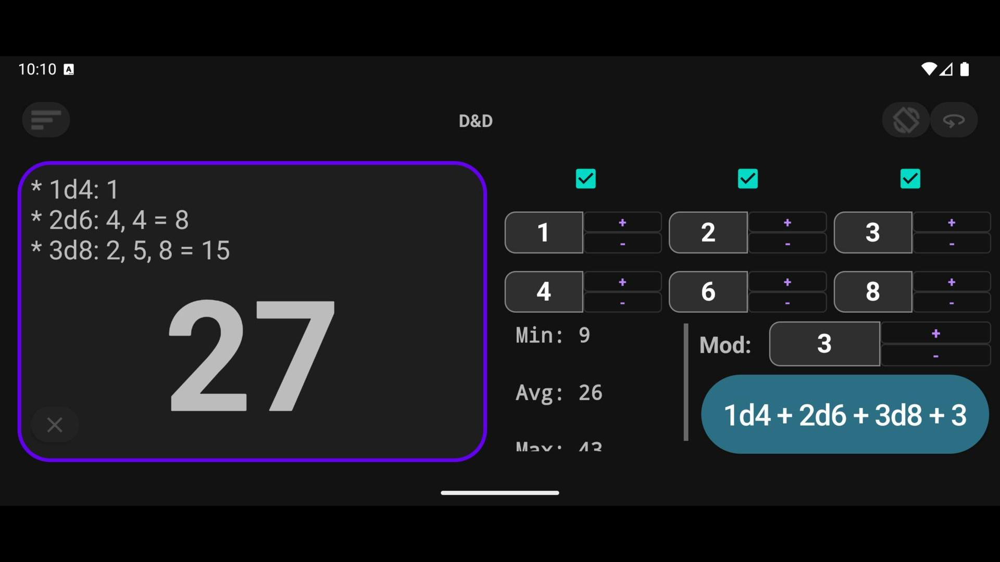
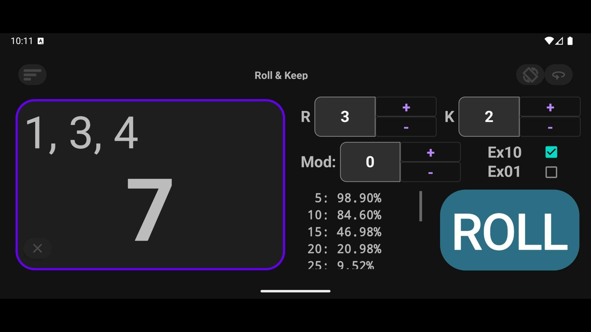
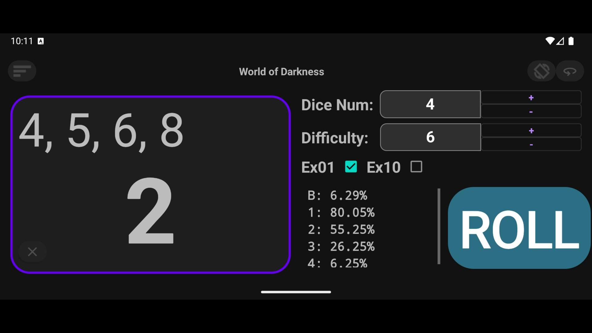
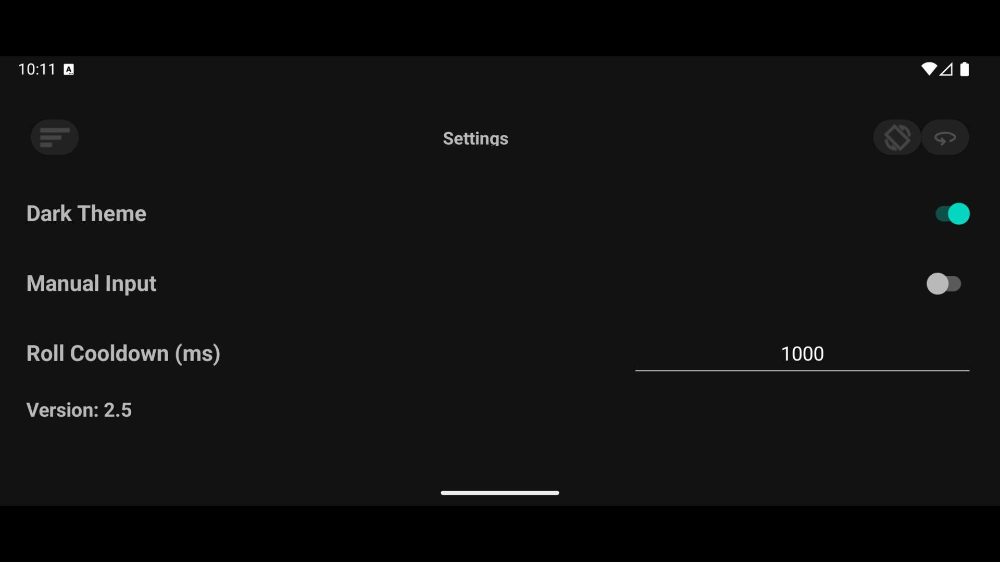

# RandoGen

[](#)
[](#)

**RandoGen** is an Android dice roller for tabletop role-playing games.

The app helps players quickly roll dice, calculate results, and estimate success probabilities before making a roll. It supports several popular dice mechanics, including **World of Darkness**, **Dungeons & Dragons**, and **Roll & Keep**.

RandoGen is designed for both phones and tablets.

## Features

* Dice rolling for multiple tabletop RPG systems
* Probability information before rolling
* Detailed roll results
* Full roll history for each throw
* Configurable bonuses and penalties
* Phone and tablet support
* Lightweight Android app

## Supported Systems

### World of Darkness

RandoGen supports dice pool rolls used in World of Darkness-style systems.

Features:

* Roll custom dice pools
* Select roll difficulty
* Enable or disable success cancellation by ones
* Enable or disable rerolling tens
* View the number of successes
* View the full sequence of rolled values

### Dungeons & Dragons

RandoGen supports custom dice expressions for Dungeons & Dragons-style rolls.

Features:

* Roll custom dice sets
* Use up to three different dice groups
* Configure the number of dice
* Configure the number of sides
* Add a bonus or penalty
* View the final result
* View detailed roll breakdowns

### Roll & Keep

RandoGen supports Roll & Keep mechanics.

Features:

* Choose the number of rolled dice
* Choose how many dice to keep
* Add a bonus or penalty
* Enable exploding tens
* Enable exploding ones
* View the final sum
* View the full roll sequence

## Probability Information

RandoGen can display probability information for supported rolls.

This helps players estimate possible outcomes before rolling and makes the app useful not only for resolving actions, but also for understanding the risk of a particular roll.

## Screenshots

<p align="center">
  
  
  
  
  
</p>

## Installation

RandoGen is available on RuStore and here.

```text
https://www.rustore.ru/catalog/app/com.example.randogen
https://github.com/LuxFurvus/RPG-Dice-Roller/blob/main/RandoGen4-release.apk
```

## Tech Stack

Update this section with the actual implementation details.

* Platform: Android
* Language: С++17, Kotlin
* Minimum Android version: 5

## Roadmap

Possible future improvements:

* Additional RPG systems
* Saved roll presets
* Roll history export
* Custom dice formulas
* Localization
* Advanced probability charts

## Status

Development of the project is completed.

## Links

* RuStore: https://www.rustore.ru/catalog/app/com.example.randogen
